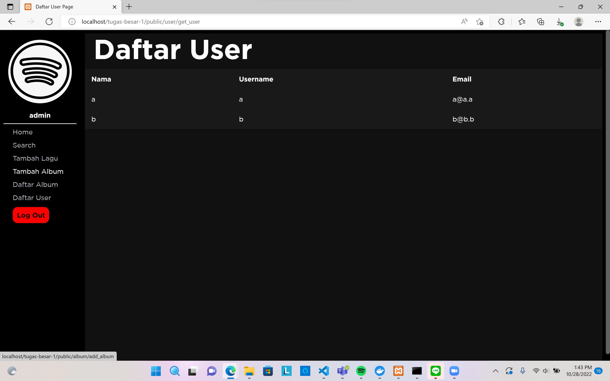

# Tugas Besar 1 IF3110 - HaBeDe
## Deskripsi Aplikasi Web

Aplikasi web yang dibuat merupakan sebuah aplikasi yang menyerupai sebuah *streaming service* berbasis web. Aplikasi akan memuat album serta lagu yang dapat didengar oleh penggunanya. Pengguna dibagi menjadi 2, *user* dan *admin*. *User* dapat melakukan hal-hal seperti melihat daftar dan detail album, melihat detail lagu, mencari lagu, mendengarkan lagu, melakukan *subscribe* kepada penyanyi yang telah mendaftar ke Binotify Premium App, dan mendengarkan lagu dari penyanyi yang telah di-*subscribe*. *Admin* dapat melakukan hal-hal yang dilakukan oleh *user* dengan tambahan seperti menghapus dan menambahkan album, menghapus dan menambahkan lagu, mendengarkan lagu, melihat daftar *user* yang ada.

## Daftar *Requirement*

- XAMPP
- MySQL
- Docker (Optional)

## Cara Instalasi

- Instalasi XAMPP dapat dilakukan melalui situs berikut. https://www.apachefriends.org/download.html
- Instalasi MySQL dapat dilakukan melalui situs berikut. https://dev.mysql.com/downloads/installer/
- Instalasi Docker dapat dilakukan melalui situs berikut. https://docs.docker.com/engine/install/

## Cara Menjalankan *Server*

- Siapkan file `.env` dengan menyalin template dari file `.env.example`. (Apabila ingin menjalankan website tanpa menggunakan database Docker, silahkan mengganti value yang sesuai untuk setiap key).

- Jika menjalankan server menggunakan Docker, jalankan perintah berikut pada terminal.

Untuk membuat dan menjalankan container di foreground

`docker compose up`

Untuk membuat dan menjalankan container di background

`docker compose up -d`

Untuk menghentikan container

`docker compose stop`

Untuk menghentikan dan menghapus container

`docker compose down`

- Jika menjalankan server tanpa menggunakan Docker, dapat dilakukan dengan menyalin atau memindahkan folder ini (`tugas-besar-1`) ke dalam folder `htdocs` dalam folder `XAMPP`. Kemudian, nyalakan server `Apache` XAMPP dan server dapat dijalankan pada `localhost/tugas-besar-1/public`.

## *Sreenshot* Tampilan Aplikasi

### Login
 

### Register
 

### Home
 

### Daftar Album
 

### Search, Sort, Filter
 

### Detail Lagu
 

### Detail Album
 

### Tambah Album
 

### Tambah Lagu
 

### Edit Album
 

### Edit Lagu
 

### Daftar User
 

### Daftar Penyanyi Premium
 

### Daftar Lagu Premium
 

## Pembagian Tugas
*Client-Side*
* Login: `13520160` 
* Register: `13520160` 
* Home: `13520133` 
* Daftar Album: `13520133` 
* Search, Sort, Filter: `13520133`, `13520154` 
* Detail Lagu: `13520154` 
* Detail Album: `13520154` 
* Tambah Album/Lagu: `13520154`, `13520160` 
* Daftar User: `13520160`  
* Daftar Penyanyi Premium: `13520133`, `13520160` 
* Daftar Lagu Premium: `13520133`, `13520160` 

*Server-Side*
* Login: `13520160` 
* Register: `13520160` 
* Home: `13520133`, `13520160` 
* Daftar Album: `13520133` 
* Search, Sort, Filter: `13520133`, `13520154`, `13520160` 
* Detail Lagu: `13520154` 
* Detail Album: `13520154` 
* Tambah Album/Lagu: `13520154`, `13520160` 
* Daftar User: `13520160`  
* Daftar Penyanyi Premium: `13520133`, `13520154` 
* Daftar Lagu Premium: `13520133`, `13520154` 